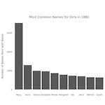
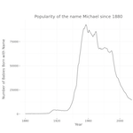
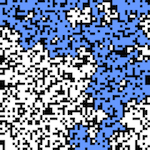
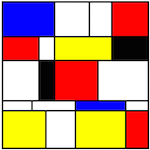

Title: Projects
Date: 2016-03-13 15:00

Check out the links below for a sample of some projects I've worked on. The current list of projects here were written in Javascript. I will also be using this area to include some d3 visualizations, shiny apps, and data projects as I develop them. You can also find some analyses on my [blog](..) that may not be included below, so be sure to check there as well! If you have an interesting project idea, definitely reach out and let me know about it!  

    <ul id="project-list">
        <li class="project-list-element">
            <a href='./most-common-baby-names-by-year.html' class="list-link">
                
                <h3>Birth Name Rankings Since 1880</h3> 
                
Here I built a Shiny app for analyzing the 10 most popular baby names (according to U.S. Seocial Security Administration data) for any year since 1880, both for males or females. If you're interested in more context or information about the implementation, please check out my  
<a href='../popularity-of-baby-names-since-1880.html'>blog post!</a>

            </a>
        </li>
        <li class="project-list-element">
            <a href='./tracking-popularity-of-individual-names.html' class="list-link">
                
                <h3>Birth Name Popularity Since 1880</h3> 
                
This is a Shiny app that graphs the popularity of a particular birth name (according to the U.S. Social Security Administration data) beginning in 1880. For more information and a thorough write-up, please check out my <a href='../popularity-of-baby-names-since-1880.html'>blog post!</a>

            </a>
        </li>
        <li class="project-list-element">
            <a href='./percolation.html' class="list-link">
                
                <h3>Percolation Problem Visualization</h3> 
                
This is a visualizer for a percolation system built upon the union-find algorithm for connectivity. This is a relatively in-depth Javascript project. For more details on the implementation, please check out my <a href='../using-javascript-to-visualize-a-percolation-system.html'>blog post!</a>

            </a>
        </li>
        <li class="project-list-element">
            <a href='./mondrian.html' class="list-link">
                
                <h3>Piet Mondrian Painting</h3> 
                
This is implemented with a simple Javascript function that allows the user to select a colors and paint a grid of divs. I created this as one of my earliest projects when I was first learning Javascript, but I still think it's pretty cool!

            </a>
        </li>

    </ul>

